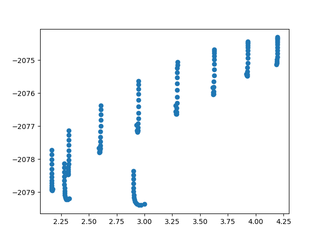

# QuantumNeuralNetwork

            
<i>Predicted Energy(kJ/mol) vs EMT Energy (kJ/mol)</i>

## Author
Sravan Jayanthi

## Density Functional Theory
The famous Nagel-Schreckenberg model, known for its use of Original Monte Carlo to model random driver behavior in traffic, was recreated using Java to gain a greater understanding of the application of Monte Carlo theory. The simulation was setup with a random variable that would influence the motion of driver behavior. Eventually, the distribution of cars deviates from the starting conditions due to the influence of the random variable. The motion of the cars are governed by four rules: each car seeks to increase speed, their speed cannot exceed the speed limit, they must slow down if there is a car ahead, and the probability p of the car slowing down. In each time step, the cars operate on these rules and are repeated until the simulation is complete. The final rule, the reduction of speed randomly, is where driver behavior will be simulated in causing potential traffic jams.

## Description
This folder contains the two scripts, the forcefield, the training data, the testing data, and the outputted validation plots
for the neural network model.
neural.py- script to train the model
test.py- script to test the model 
training_data.traj- data used to train the model
validation_data.traj- data used to test the model
calc.amp- the outputted model

### Code
Sample code of updating speed of a car facing traffic.

            velocityCurrentArray[i] = Math.min((velocityCurrentArray[i]), (minDist-1));
            double prop = Math.random();
            if (prop >= pCrit) {
                velocityCurrentArray[i] = Math.max(0, (velocityCurrentArray[i]-1));
            }
            positionArray[i] = positionArray[i] + velocityCurrentArray[i];
            if (positionArray[i] > MSpaces) {
                positionArray[i] = positionArray[i] - MSpaces;
            }

## License
[GNU](LICENSE)
